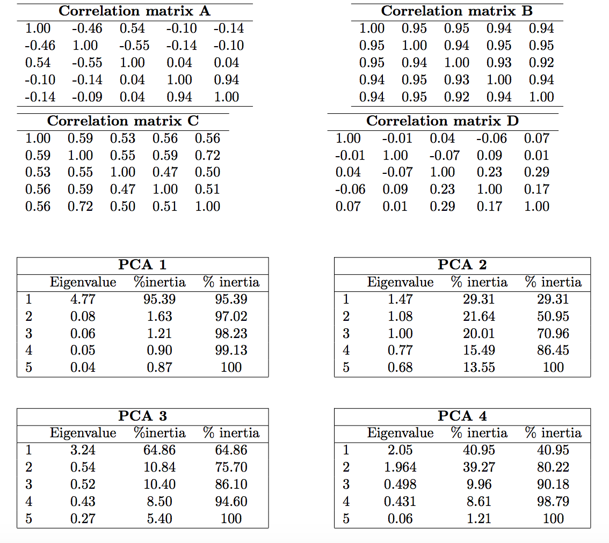

#  Principal Component Analysis

## Lecture questions

1) When do we need to scale the variables? Simulate and comment:
```{r eval = TRUE}
library(mvtnorm)
Z <- rmvnorm(n = 200, rep(0, 3), sigma = diag(3))
X1 <- Z[, 1]
X2 <- X1 + 0.001*Z[, 2]
X3 <- 10*Z[, 3]
don <- cbind.data.frame(X1, X2, X3)

library(FactoMineR)
res.pca <- PCA(don, scale = F)
res.pcascaled <- PCA(don, scale = T)
```

Centering and scaling is important when the variables have different units, such as height (cm) and weight (kg). This prevents the main directions from being governed by one or more variables with a higher variance than the other variables. When the variables have the same unit, scaling should be considered on a case-by-case basis.


2) TRUE or FALSE. If you perform a standardized PCA on a huge number of variables: the percentage of variability of the two first dimensions is small.

There is no general rule for this. In the case of independent Gaussian variables, the percentage of variability decreases with the dimension. On the other hand, consider a data set where the same variable is repeated into each column. The percentage variability of the 2 first dimension will then be 100% regardless of the number of columns. 


3) A scaled PCA has been performed on 4 data sets. Link correlation matrices and PCA results.

```{r, echo = FALSE, out.width= '75%', fig.align='center'}

```

A - 4; B - 1; C - 3; D - 2.

The value of the first eigenvalue approximately gives the number of correlated variables explained by the first dimension.


a. The matrix A seems to be a block diagonal matrix with blocks of size $3x3$ and $2x2$. The block of size $2x2$ is close to the matrix with only ones (which is of rank 1) thus one eigenvalue must be close to zero. This corresponds to PCA 4.

b. The matrix B is has all its entries near one, thus it is close to a matrix of
rank one. If this matrix was of rank one, the variance could be explained with
the first component only. In that case, the inertia associated with the first
component would be $5$ and $0$ for the other components. This corresponds to PCA 1.

c. The matrix D is close to the identity. The PCA applied to the identity would
give the same inertia to all components (inertia close to 1). This corresponds
to PCA 2.

d. The matrix C is similar to B but the correlation are weaker. Thus the first
component has a high inertia. This corresponds to PCA 3.


4) What is the percentage of variability of the first dimension? The first plane?

```{r, echo = FALSE, out.width= '50%', fig.align='center'}
knitr::include_graphics("./AnaDo_ACP_exo_Graphe_var2.jpg")
```

The answer is given by the number of variables aligned with the first two dimensions divided by the total number of variables. The first dimension explains 44% of the variability and the first plane 77%.

The percentage of explained variance is equal to the sum of square norms of
projection of variables along the first axis. Variables V5, V6, V9 are
orthogonal to the first axis and variables V7 and V8 are not well represented by
the first plan (and thus are orthogonal to this plan and in particular to the
first axis). Roughly, the norm of V1, V2, V3 and V4 is one which leads to a
percentage of variance for the first axis equal to $4/9$. Similarly, for the
first plan, we have a percentage of variance equal to $7/9$ since the norm of
$V5$ and $V9$ is close to one.

5) Simulate a table with 500 samples and 335 variables (330 independent variables and 5 variables highly correlated). Perform the PCA. Then, decrease the sample size n= 1 00, 50, 20. Comment.**

```{r echo = TRUE} 
library(MASS) 
nb_obs=500 
Sigma1 = diag(330) 
mat1 = mvrnorm(n = nb_obs, mu=rep(0,330), Sigma= Sigma1)

x <- c(1, 4/5, 3/5, 2/5, 1/5) 
Sigma2 =  toeplitz (x) 
mat2 = mvrnorm(n = nb_obs,mu=rep(0,5), Sigma=Sigma2)

mat <- cbind(mat1,mat2) 
PCA(mat) 
```


```{r echo = TRUE} 
library(MASS) 
nb_obs=20 
Sigma1 = diag(330) 
mat1 = mvrnorm(n =nb_obs, mu=rep(0,330), Sigma= Sigma1)

x <- c(1, 4/5, 3/5, 2/5, 1/5) 
Sigma2 =  toeplitz (x) 
mat2 = mvrnorm(n = nb_obs,mu=rep(0,5), Sigma=Sigma2)

mat <- cbind(mat1,mat2) 
PCA(mat) 
```

When the number of observations decreases, it becomes difficult to clearly
identify the correlated variables. For $n=500$, the five correlated variables
are highly correlated with the first axis and very well represented by it. If we
carry out the same analysis but with less data, the correlated variable blend in
the mass of independent variables, which means that it is difficult to
distinguish a true correlation when you have a huge number of variables and a
small number of observations.

## PCA on decathlon data

```{r import-load, eval = FALSE, results='hide'}
# Install the package
#install.packages("FactoMineR", dependencies = TRUE)
# Load the package
library(FactoMineR)
data(decathlon)
head(decathlon)
```

This dataset contains the results of decathlon events during two athletic meetings which took place one month apart in 2004: the Olympic Games in Athens (23 and 24 August), and the Decastar 2004 (25 and 26 September). For both competitions, the following information is available for each athlete: performance for each of the 10 events, total number of points (for each
event, an athlete earns points based on performance; here the sum of points
scored) and final ranking. The events took place in the following order: 100 meters, long jump, shot put, high jump, 400 meters (first day) and 110 meter hurdles, discus, pole vault, javelin, 1500 meters (second
day). Nine athletes participated to both competitions. We would like to obtain a typology of the performance profiles.

1) You should inspect the data set with the following commands:
```{r dim, eval=FALSE}
summary(decathlon)
dim(decathlon)
#View(decathlon)
#?decathlon
rownames(decathlon)
```


2) Explain the interest of centering and scaling the data. Could you spotlight outstanding athletes ? Which inequality are you using?

When the data are standardized, it is possible to compare two variables with different units and to say sentences such as "Paul is more remarkable by his height than John is by is weight".
When looking at the standardized data, we can look for the values greater or smaller than 2 for instance. We are refering to Bienayme-Tchebychev which states that 25% of the observations will be at 2 standard deviation from their means. If we consider Gaussian data, we can refine this inequality and consider know that 4.5 % of the observations are greater than 2 in absolute value. Sebrle value for Javeline is 2.528251350 meaning that he is far above average. 


The aim of conducting PCA on this dataset is to determine profiles for similar performances: are there any athletes who are
better at endurance events or those requiring short bursts of energy, etc? And are some of the events similar? If an athlete performs well in one event, will he necessarily perform well in another?

3) Explain your choices for the active and illustrative variables/individuals and perform the PCA on this data set.

```{r, eval = FALSE, include = TRUE}
 res.pca <- PCA(decathlon, quanti.sup = c(11,12) , quali.sup = 13)
 summary(res.pca, nbelements = 5, ncp = 4)
 barplot(res.pca$eig[,1], main = "Eigenvalues",
 names.arg = paste("Dim",1:nrow(res.pca$eig), sep=""))
 plot(res.pca, choix = "ind", axes = c(3, 4))
 plot(res.pca, choix = "var", axes = c(3, 4))
```


To obtain a typology of the athletes based on their performances for the 10
decathlon events, such as "two athletes are close as they have similar
performance profiles", the distances between two athletes are defined on the
basis of their performances in the 10 events. Thus, only the performance
variables are considered active; the other variables (number of points, rank,
and competition) are supplementary. Here, the athletes are all considered as active
individuals.

4) Comment the percentage of variability explained by the two first dimensions. What would you like (a small percentage, a high percentage) and why?

The first two dimensions  summarize 50\% of the total inertia, i.e. 50\% of the total variability of the cloud of individuals (or variables) is represented by the first 2d plane. The importance of this percentage cannot be assessed without taking into account the number of active individuals and active variables. It may be interesting to compare this percentage with that of the 0.95 -quantile distribution of the percentages obtained by simulating data of equivalent size on the basis of independent normal distribution. According to
the table provided in the slides, this quantile obtained for 40 individuals and 10 variables is about 38\%: although the percentage of 50\% seems relatively low, it expresses a significant structure in the data. However, the total variability cannot be summarized by the first two dimensions only. It may also be interesting to interpret components 3 and 4 for which the inertia is greater than 1 (this value is used as a reference because it represents, in the case of
standardized variables, the contribution of a single variable).
It can also be said that a high percentage means that the 10 events are redundant and that we do not need 10 sport events to rank athletes.


5) Comment: 
- the correlation between the 100 m and long.jump
- the correlation between long.jump and Pole.vault
- can you describe the athlete Casarsa? 
- the proximity between Sebrle and Clay 
- the proximity between Schoenbeck and Barras

- The 100m and long.jump are negatively correlated: therefore, an
athlete who runs 100 meters quickly will generally jump a long way. The
variables 100m, 400m, and 110m hurdles are positively correlated, that is, some
athletes perform well in all four events while others do not.

- Since long.jump is well represented in the first plan and Pole.vault is not, we
can deduce that long.jump and Pole.vault are approximately orthogonal, meaning
that the corresponding variables are roughly uncorrelated.

Overall, the variables relating to speed are negatively correlated with the
first principal component while the variables shot put and long jump are
positively correlated with this component. The coordinates of these active
variables can be found in the object res.pca$var which also gives the
representation quality of the variables (cosine squared) and their contributions
to the construction of the components.

```{r, echo = TRUE, eval = FALSE}
round(cbind(res.pca$var$coord[,1:4],res.pca$var$cos2[,1:4],
res.pca$var$contrib[,1:4]),2) 
```

Bourguignon and Karpov have very different performance profiles since they are
opposed according to the main axis of variability. 


- Casarsa is located on the top left corner. The first dimension is highly correlated with the number of points: this indicates that he does not have a large number of points. The second dimension is correlated with the Shot.put, High.jump and Discus. This indicates that Casarsa had good results in these three sports. Remember that the second dimension is calculated orthogonally to the first. So Casarsa has good results in these three sports compared to other "bad" athletes.

- Sebrle and Clay are close to one another and both far from the center of gravity of the cloud of points. The quality of their projection is therefore good, and we can be certain that they are indeed close in the original space. This means that they have similar profiles in their results across all sports events.

- Schoenbeck and Barras are close to one another but they are also close to the center of gravity of the cloud of points. When looking at their cos2 they are not well projected, We cannot interpret their distance based on this plot only.


The coordinates of these individuals can be found in
res.pca$ind. Below is a sample output provided by the PCA function. We obtain a
data table with the coordinates, the cosine squared (which gives an idea of the
quality of the projection of the individuals on a component), and the
contributions for each individual (to know how much an individual contributes to
the construction of a component).

```{r, echo = TRUE, eval = FALSE}
round(cbind(res.pca$ind$coord[,1:4],res.pca$ind$cos2[,1:4],
res.pca$ind$contrib[,1:4]),2) 
```

6) Enhance the graphical outputs with the following options:
```{r eval = FALSE}
 plot.PCA(res.pca, choix = "ind", habillage = ncol(decathlon), cex = 0.7)
 plot.PCA(res.pca, choix = "ind", habillage = ncol(decathlon), cex = 0.7, 
 autolab = "no")
 plot(res.pca, select = "cos2 0.8",  invisible = "quali")
 plot(res.pca, select = "contrib 10")
 plot(res.pca, choix = "var", select = "contrib 8", unselect = 0)
 plot(res.pca, choix = "var", select = c("400m", "1500m"))
```

7) In which trials those who win the decathlon perform the best? Could we say that the decathlon trials are well selected? 

The supplementary variable "number of points" is almost collinear to the first
principal component. Therefore, the athletes with a high number of points are
particularly good in the trials correlated with the first principal component.
Those who win the decathlon perform the best in 100m, 110m hurdles and long jump. This means that the ranking of the decathlon is governed by those three sports.


8) Compare and comment the performances during both events: Decastar and Olympic. Could we conclude on the differences?  Perform a test or plot Confidence ellipses:

```{r }
dimdesc(res.pca)
dimdesc(res.pca, proba = 0.2) 
plotellipses(res.pca)
```

This function is very useful when there are a great number of variables. We see
here that the first component is mainly due to the variable number of points
(with a correlation coefficient of 0.96), and the variable 100m (with a negative
correlation). The second component is described by two quantitative variables
only (discus and shot put). No category of any categorical variable
characterizes components 1 and 2 with a confidence level of 95%. 

However, with the confidence level of 0.8, we can say that both of the two categories
Olympic Games and Decastar have coordinates that are significantly different
from 0 on the first component. As the value is positive (negative) for the
Olympic Games (Decastar) we can say that individuals who participated in the
Olympic Games tended to have positive coordinates (or negative, respectively) on
component 1.

9) To select the number of dimensions, you should have a look at 
```{r eval = FALSE}
?estim_ncp
```
which performs cross validation as detailed in the lecture slides.

